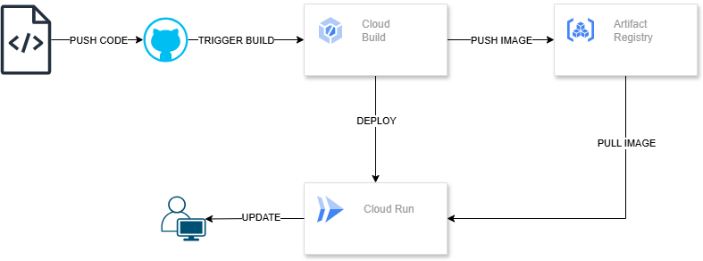
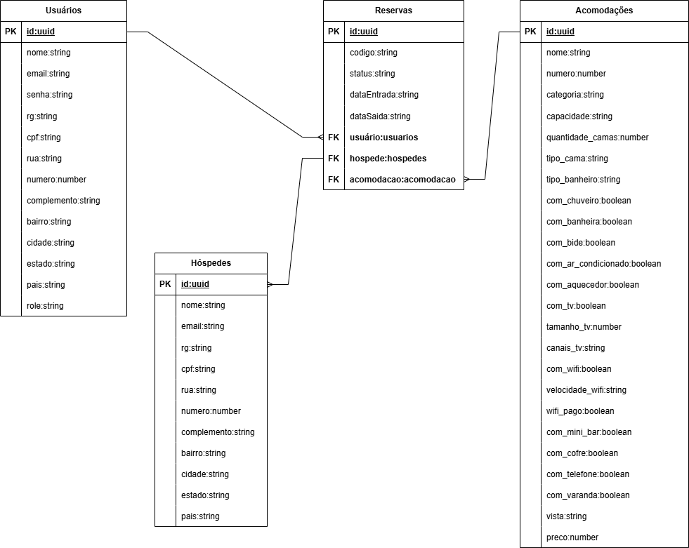

## Sistema de Gerenciamento de Pousada

Este projeto em Node.js com NestJS implementa um sistema de gerenciamento de pousada, fornecendo APIs RESTful para gerenciar usuários, hóspedes, acomodações e reservas.

**Funcionalidades Principais:**

- **Gerenciamento de Usuários:** Permite criar, visualizar, atualizar e deletar usuários do sistema, com diferentes roles de acesso.
- **Gerenciamento de Hóspedes:** Cadastro e gerenciamento de informações de hóspedes, incluindo nome, contato e endereço.
- **Gerenciamento de Acomodações:** Permite adicionar, editar e remover informações sobre as acomodações disponíveis na pousada, incluindo tipo de quarto, capacidade, comodidades e preços.
- **Sistema de Reservas:** Os usuários podem criar, visualizar, atualizar e cancelar reservas, verificando a disponibilidade das acomodações.

## Arquitetura

O projeto segue a arquitetura do NestJS, utilizando os seguintes módulos:

- **Módulo de Usuário:** Gerencia todas as operações relacionadas aos usuários.
- **Módulo de Hóspede:** Responsável por lidar com as informações dos hóspedes.
- **Módulo de Acomodação:** Gerencia as informações sobre as acomodações.
- **Módulo de Reserva:** Responsável pelo sistema de reservas.

<p align="center">
  
</p>

## Tecnologias Utilizadas

- **Node.js:** Ambiente de execução JavaScript.
- **NestJS:** Framework progressivo para construção de aplicações Node.js eficientes e escaláveis.
- **TypeORM:** ORM para mapeamento objeto-relacional, utilizado para interagir com o banco de dados.
- **PostgreSQL:** Banco de dados relacional para armazenar os dados da aplicação.
- **Class-validator:** Para validação de dados.

## Arquitetura CI/CD

<p align="center">
  
</p>

## Modelagem de Dados

O sistema utiliza as seguintes entidades para representar os dados:

**Tabela Usuário:**

| Coluna | Tipo | Descrição |
| --- | --- | --- |
| id | uuid | Identificador único do usuário (gerado automaticamente) |
| nome | string | Nome completo do usuário |
| email | string | Endereço de e-mail do usuário |
| senha | string | Senha do usuário (armazenada criptografada) |
| rg | string | Número do RG do usuário |
| cpf | string | Número do CPF do usuário |
| rua | string | Nome da rua do endereço do usuário |
| numero | int | Número da residência do usuário |
| complemento | string | Complemento do endereço do usuário (opcional) |
| bairro | string | Bairro do endereço do usuário |
| cidade | string | Cidade do endereço do usuário |
| estado | string | Estado do endereço do usuário |
| pais | string | País do endereço do usuário |
| role | string | Papel do usuário no sistema (ex: admin, usuário) |
| createdAt | string | Data e hora de criação do registro |
| updatedAt | string | Data e hora da última atualização do registro |
| deletedAt | string | Data e hora da exclusão lógica do registro (se aplicável) |

**Tabela Hóspede:**

| Coluna | Tipo | Descrição |
| --- | --- | --- |
| id | uuid | Identificador único do hóspede (gerado automaticamente) |
| nome | string | Nome completo do hóspede |
| email | string | Endereço de e-mail do hóspede |
| rg | string | Número do RG do hóspede |
| cpf | string | Número do CPF do hóspede |
| rua | string | Nome da rua do endereço do hóspede |
| numero | int | Número da residência do hóspede |
| complemento | string | Complemento do endereço do hóspede (opcional) |
| bairro | string | Bairro do endereço do hóspede |
| cidade | string | Cidade do endereço do hóspede |
| estado | string | Estado do endereço do hóspede |
| pais | string | País do endereço do hóspede |
| createdAt | string | Data e hora de criação do registro |
| updatedAt | string | Data e hora da última atualização do registro |
| deletedAt | string | Data e hora da exclusão lógica do registro (se aplicável) |

**Tabela Acomodação:**

| Coluna | Tipo | Descrição |
| --- | --- | --- |
| id | uuid | Identificador único da acomodação (gerado automaticamente) |
| nome | string | Nome da acomodação (ex: Quarto Duplo, Suíte) |
| numero | int | Número da acomodação |
| categoria | string | Categoria da acomodação (ex: Standard, Luxo) |
| capacidade | int | Capacidade máxima de pessoas da acomodação |
| quantidade_camas | int | Quantidade de camas na acomodação |
| tipo_cama | string | Tipo de cama na acomodação (ex: Solteiro, Casal, King Size) |
| tipo_banheiro | string | Tipo de banheiro (ex: Privativo, Compartilhado) |
| com_chuveiro | boolean | Indica se a acomodação possui chuveiro |
| com_banheira | boolean | Indica se a acomodação possui banheira |
| com_bide | boolean | Indica se a acomodação possui bidê |
| com_ar_condicionado | boolean | Indica se a acomodação possui ar condicionado |
| com_aquecedor | boolean | Indica se a acomodação possui aquecedor |
| com_tv | boolean | Indica se a acomodação possui TV |
| tamanho_tv | int | Tamanho da TV em polegadas (se aplicável) |
| canais_tv | string | Canais de TV disponíveis (opcional) |
| com_wifi | boolean | Indica se a acomodação possui Wi-Fi |
| velocidade_wifi | string | Velocidade do Wi-Fi (ex: 100mbps, 500mbps) |
| wifi_pago | boolean | Indica se o Wi-Fi é pago |
| com_mini_bar | boolean | Indica se a acomodação possui frigobar |
| com_cofre | boolean | Indica se a acomodação possui cofre |
| com_telefone | boolean | Indica se a acomodação possui telefone |
| com_varanda | boolean | Indica se a acomodação possui varanda |
| vista | string | Descrição da vista da acomodação (opcional) |
| preco | float | Preço da diária da acomodação |
| createdAt | string | Data e hora de criação do registro |
| updatedAt | string | Data e hora da última atualização do registro |
| deletedAt | string | Data e hora da exclusão lógica do registro (se aplicável) |

**Tabela Reserva:**

| Coluna | Tipo | Descrição |
| --- | --- | --- |
| id | uuid | Identificador único da reserva (gerado automaticamente) |
| codigo | string | Código único da reserva (gerado automaticamente) |
| usuarioId | uuid | ID do usuário que realizou a reserva |
| acomodacaoId | uuid | ID da acomodação reservada |
| dataEntrada | string | Data de entrada na acomodação |
| dataSaida | string | Data de saída da acomodação |
| status | enum | Status da reserva (ex: EM_PROCESSAMENTO, RESERVADO, CANCELADO, CONCLUIDO) |
| valorTotal | float | Valor total da reserva |
| createdAt | string | Data e hora de criação da reserva |
| updatedAt | string | Data e hora da última atualização da reserva |
| deletedAt | string | Data e hora da exclusão lógica da reserva (se aplicável) |

## Diagrama DER

<p align="center">
  
</p>

## Configuração do Banco de Dados

Este projeto utiliza Docker Compose para configurar o banco de dados PostgreSQL e o PgAdmin4.

1. **Crie um arquivo docker-compose.yml na raiz do projeto com o seguinte conteúdo:**

```yaml
version: '3.1'

services:
  db:
    image: postgres
    ports:
      - 5432:5432
    environment:
      POSTGRES_PASSWORD: root
      POSTGRES_DB: ypua
    networks:
      - postgres-compose-network

  db-admin:
    image: dpage/pgadmin4
    ports:
      - 15432:80
    environment:
      PGADMIN_DEFAULT_EMAIL: "root@root.com"
      PGADMIN_DEFAULT_PASSWORD: "root"
    depends_on:
      - db
    networks:
      - postgres-compose-network

networks:
  postgres-compose-network:
    driver: bridge

```

2. **Suba os serviços do Docker Compose:**

```bash
docker-compose up -d

```

3. **Acesse o PgAdmin4 em seu navegador:**

```
http://localhost:15432/

```

4. **Conecte-se ao banco de dados `ypua` utilizando as credenciais definidas no arquivo docker-compose.yml.**

## Dockerização do Backend

O backend da aplicação pode ser facilmente dockerizado utilizando o seguinte `Dockerfile`:

```yaml
# Base da imagem - Node.js
FROM node:18-alpine

# Define o diretório de trabalho dentro do container
WORKDIR /app

# Copia o package.json e package-lock.json para o container
COPY package*.json ./

# Instala as dependências
RUN npm install

# Copia o código da aplicação para o container
COPY . .

# Define a porta de exposição (opcional)
EXPOSE ${PORT}

# Comando para executar a aplicação
CMD ["npm", "run", "start:dev"]

```

**Para construir a imagem Docker:**

```bash
docker build -t pousada-backend .

```

**Para executar o container Docker:**

```bash
docker run -p 3000:3000 -e PORT=3000 pousada-backend
```

## Como Executar o Projeto

**Pré-requisitos:**

- Node.js e npm (ou yarn) instalados.

**Passos:**

1. **Clone o repositório do projeto:**
    
    ```bash
    git clone <URL_DO_REPOSITORIO>
    ```
    
2. **Instale as dependências:**
    
    ```bash
    cd <PASTA_DO_PROJETO>
    npm install
    ```
    
3. **Configure as variáveis de ambiente:**
    
    Crie um arquivo `.env` na raiz do projeto e defina as seguintes variáveis:
    
    ```
    DATABASE_HOST=localhost
    DATABASE_PORT=5432
    DATABASE_USER=seu_usuario
    DATABASE_PASSWORD=sua_senha
    DATABASE_NAME=nome_do_banco
    PORT=3000
    ```
    
4. **Execute as migrations do banco de dados:**
    
    ```bash
    npm run typeorm migration:run
    
    ```
    
5. **Inicie a aplicação:**
    
    ```bash
    # development
    $ npm run start

    # watch mode
    $ npm run start:dev

    # production mode
    $ npm run start:prod
    ```
    

## Documentação da API

**Entidade Usuário:**

| Método | Rota | Descrição | Parâmetros | Corpo da Requisição (JSON) | Resposta (JSON) |
| --- | --- | --- | --- | --- | --- |
| POST | /usuarios | Cria um novo usuário. |  | json { "nome": "Nome do Usuário", "email": "usuario@example.com", "senha": "senha123", "rg": "12.345.678-9", "cpf": "123.456.789-00", "rua": "Nome da Rua", "numero": 123, "complemento": "Apto 101", "bairro": "Nome do Bairro", "cidade": "Nome da Cidade", "estado": "SP", "pais": "Brasil", "role": "usuario" } | json { "usuario": { "id": "uuid-do-usuario", "nome": "Nome do Usuário" }, "message": "usuario criado com sucesso!" } |
| GET | /usuarios | Retorna uma lista de todos os usuários. |  |  | json [ { "id": "uuid-do-usuario-1", "nome": "Nome do Usuário 1" }, { "id": "uuid-do-usuario-2", "nome": "Nome do Usuário 2" } ] |
| GET | /usuarios/:id | Retorna um usuário específico pelo ID. | id (string, obrigatório): ID do usuário. |  | json { "id": "uuid-do-usuario", "nome": "Nome do Usuário", "email": "usuario@example.com", ... } |
| PUT | /usuarios/:id | Atualiza um usuário específico pelo ID. | id (string, obrigatório): ID do usuário. | json { "nome": "Novo Nome do Usuário", "email": "novoemail@example.com", ... } | json { "usuario": { "id": "uuid-do-usuario", "nome": "Novo Nome do Usuário", "email": "novoemail@example.com", ... }, "message": "usuario atualizado com sucesso!" } |
| DELETE | /usuarios/:id | Deleta um usuário específico pelo ID. | id (string, obrigatório): ID do usuário. |  | json { "usuario": { "id": "uuid-do-usuario", ... }, "message": "usuario removido com sucesso!" } |

**Entidade Hóspede:**

| Método | Rota | Descrição | Parâmetros | Corpo da Requisição (JSON) | Resposta (JSON) |
| --- | --- | --- | --- | --- | --- |
| POST | /hospedes | Cria um novo hóspede. |  | json { "nome": "Nome do Hóspede", "email": "hospede@example.com", "rg": "12.345.678-9", "cpf": "123.456.789-00", "rua": "Nome da Rua", "numero": 123, "complemento": "Apto 101", "bairro": "Nome do Bairro", "cidade": "Nome da Cidade", "estado": "SP", "pais": "Brasil" } | json { "usuario": { "id": "uuid-do-hospede", "nome": "Nome do Hóspede" }, "message": "hospede criado com sucesso!" } |
| GET | /hospedes | Retorna uma lista de todos os hóspedes. |  |  | json [ { "id": "uuid-do-hospede-1", "nome": "Nome do Hóspede 1" }, { "id": "uuid-do-hospede-2", "nome": "Nome do Hóspede 2" } ] |
| GET | /hospedes/:id | Retorna um hóspede específico pelo ID. | id (string, obrigatório): ID do hóspede. |  | json { "id": "uuid-do-hospede", "nome": "Nome do Hóspede", "email": "hospede@example.com", ... } |
| PUT | /hospedes/:id | Atualiza um hóspede específico pelo ID. | id (string, obrigatório): ID do hóspede. | json { "nome": "Novo Nome do Hóspede", "email": "novoemail@example.com", ... } | json { "usuario": { "id": "uuid-do-hospede", "nome": "Novo Nome do Hóspede", "email": "novoemail@example.com", ... }, "message": "hospede atualizado com sucesso!" } |
| DELETE | /hospedes/:id | Deleta um hóspede específico pelo ID. | id (string, obrigatório): ID do hóspede. |  | json { "usuario": { "id": "uuid-do-hospede", ... }, "message": "hospede removido com sucesso!" } |

**Entidade Acomodação:**

| Método | Rota | Descrição | Parâmetros | Corpo da Requisição (JSON) | Resposta (JSON) |
| --- | --- | --- | --- | --- | --- |
| POST | /acomodacoes | Cria uma nova acomodação. |  | json { "nome": "Quarto Duplo Standard", "numero": 101, "categoria": "Standard", "capacidade": 2, "quantidadeCamas": 1, "tipoCama": "Casal", "tipoBanheiro": "Privativo", "comChuveiro": true, "comBanheira": false, "comBide": false, "comArCondicionado": true, "comAquecedor": false, "comTV": true, "tamanhoTV": 32, "canaisTV": "Canais a cabo", "comWifi": true, "velocidadeWifi": "100mbps", "wifiPago": false, "comMiniBar": true, "comCofre": true, "comTelefone": true, "comVaranda": false, "vista": "Vista para o jardim", "preco": 250.00 } | json { "usuario": { "id": "uuid-da-acomodacao", "nome": "Quarto Duplo Standard" }, "message": "acomodacao criada com sucesso!" } |
| GET | /acomodacoes | Retorna uma lista de todas as acomodações. |  |  | json [ { "id": "uuid-da-acomodacao-1", "nome": "Quarto Duplo Standard" }, { "id": "uuid-da-acomodacao-2", "nome": "Suíte Luxo" } ] |
| GET | /acomodacoes/:id | Retorna uma acomodação específica pelo ID. | id (string, obrigatório): ID da acomodação. |  | json { "id": "uuid-da-acomodacao", "nome": "Quarto Duplo Standard", "numero": 101, ... } |
| PUT | /acomodacoes/:id | Atualiza uma acomodação específica pelo ID. | id (string, obrigatório): ID da acomodação. | json { "nome": "Quarto Duplo Luxo", "categoria": "Luxo", ... } | json { "usuario": { "id": "uuid-da-acomodacao", "nome": "Quarto Duplo Luxo", "categoria": "Luxo", ... }, "message": "acomodacao atualizada com sucesso!" } |
| DELETE | /acomodacoes/:id | Deleta uma acomodação específica pelo ID. | id (string, obrigatório): ID da acomodação. |  | json { "usuario": { "id": "uuid-da-acomodacao", ... }, "message": "acomodacao removida com sucesso!" } |

**Entidade Reserva:**

| Método | Rota | Descrição | Parâmetros | Corpo da Requisição (JSON) | Resposta (JSON) |
| --- | --- | --- | --- | --- | --- |
| POST | /reservas | Cria uma nova reserva. |  | json { "usuarioId": "uuid-do-usuario", "acomodacaoId": "uuid-da-acomodacao", "dataEntrada": "2024-03-10", "dataSaida": "2024-03-15", "status": "EM_PROCESSAMENTO", "valorTotal": 1250.00 } | json { "reserva": { "id": "uuid-da-reserva", "codigo": "CODIGO-DA-RESERVA", ... }, "message": "reserva criada com sucesso!" } |
| GET | /reservas | Retorna uma lista de todas as reservas. |  |  | json [ { "id": "uuid-da-reserva-1", "codigo": "CODIGO-DA-RESERVA-1", ... }, { "id": "uuid-da-reserva-2", "codigo": "CODIGO-DA-RESERVA-2", ... } ] |
| GET | /reservas/:id | Retorna uma reserva específica pelo ID. | id (string, obrigatório): ID da reserva. |  | json { "id": "uuid-da-reserva", "codigo": "CODIGO-DA-RESERVA", "usuarioId": "uuid-do-usuario", ... } |
| GET | /reservas/nome/:nome | Retorna uma lista de reservas pelo nome do hóspede. | nome (string, obrigatório): Nome do hóspede. |  | json [ { "id": "uuid-da-reserva-1", "codigo": "CODIGO-DA-RESERVA-1", ... }, { "id": "uuid-da-reserva-2", "codigo": "CODIGO-DA-RESERVA-2", ... } ] |
| GET | /reservas/cpf/:cpf | Retorna uma lista de reservas pelo CPF do hóspede. | cpf (string, obrigatório): CPF do hóspede. |  | json [ { "id": "uuid-da-reserva-1", "codigo": "CODIGO-DA-RESERVA-1", ... }, { "id": "uuid-da-reserva-2", "codigo": "CODIGO-DA-RESERVA-2", ... } ] |
| PUT | /reservas/:id | Atualiza uma reserva específica pelo ID. | id (string, obrigatório): ID da reserva. | json { "status": "RESERVADO", "valorTotal": 1300.00 } | json { "reserva": { "id": "uuid-da-reserva", "codigo": "CODIGO-DA-RESERVA", "status": "RESERVADO", ... }, "message": "reserva atualizada com sucesso!" } |
| DELETE | /reservas/:id | Deleta uma reserva específica pelo ID. | id (string, obrigatório): ID da reserva. |  | json { "reserva": { "id": "uuid-da-reserva", ... }, "message": "reserva removida com sucesso!" } |

**Observações:**

- Certifique-se de substituir os valores entre `< >` pelos valores reais.
- As datas devem estar no formato `YYYY-MM-DD`.
- O status da reserva pode ser um dos seguintes: `EM_PROCESSAMENTO`, `RESERVADO`, `CANCELADO` ou `CONCLUIDO`.

## Próximos Passos:

- Implementar autenticação e autorização para proteger as rotas da API.
- Criar testes unitários e de integração para garantir a qualidade do código.
- Implementar uma interface gráfica para o sistema.
- Documentar completamente a API utilizando uma ferramenta como Swagger.

## Suporte

Para dúvidas entre em contato com o desenvolvedor [Lucas Salomão](lucastadeusalomao@gmail.com).

## License

Nest is [MIT licensed](LICENSE).