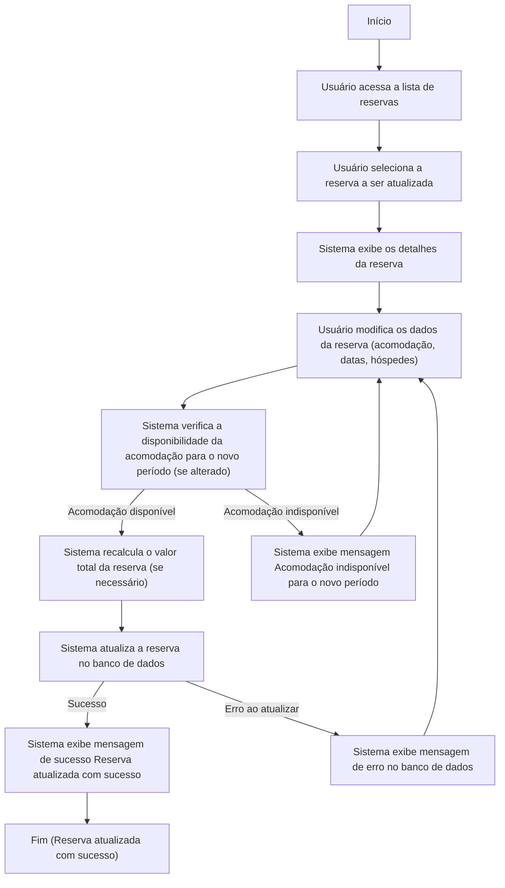

```mermaid
graph TD
    A[Início] --> B[Usuário acessa a lista de reservas];
    B --> C[Usuário seleciona a reserva a ser atualizada];
    C --> D[Sistema exibe os detalhes da reserva];
    D --> E["Usuário modifica os dados da reserva (acomodação, datas, hóspedes)"];
    E --> F["Sistema verifica a disponibilidade da acomodação para o novo período (se alterado)"];
    F -- Acomodação disponível --> G["Sistema recalcula o valor total da reserva (se necessário)"];
    G --> H[Sistema atualiza a reserva no banco de dados];
    H -- Sucesso --> I["Sistema exibe mensagem de sucesso "Reserva atualizada com sucesso""];
    I --> J["Fim (Reserva atualizada com sucesso)"];
    F -- Acomodação indisponível --> K["Sistema exibe mensagem "Acomodação indisponível para o novo período""];
    K --> E;
    H -- Erro ao atualizar --> L[Sistema exibe mensagem de erro no banco de dados];
    L --> E;
```