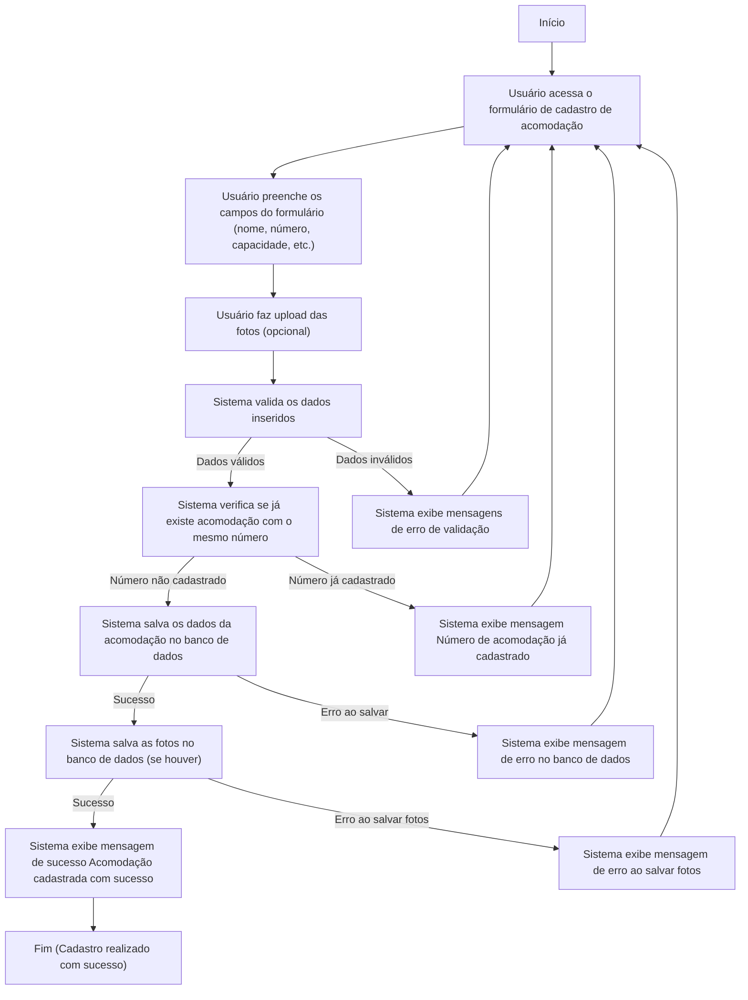

```mermaid
graph TD
    A[Início] --> B[Usuário acessa o formulário de cadastro de acomodação];
    B --> C["Usuário preenche os campos do formulário (nome, número, capacidade, etc.)"];
    C --> D["Usuário faz upload das fotos (opcional)"];
    D --> E[Sistema valida os dados inseridos];
    E -- Dados válidos --> F[Sistema verifica se já existe acomodação com o mesmo número];
    F -- Número não cadastrado --> G[Sistema salva os dados da acomodação no banco de dados];
    F -- Número já cadastrado --> H["Sistema exibe mensagem "Número de acomodação já cadastrado""];
    H --> B;
    G -- Sucesso --> I["Sistema salva as fotos no banco de dados (se houver)"];
    I -- Sucesso --> J["Sistema exibe mensagem de sucesso "Acomodação cadastrada com sucesso""];
    J --> K["Fim (Cadastro realizado com sucesso)"];
    E -- Dados inválidos --> L[Sistema exibe mensagens de erro de validação];
    L --> B;
    G -- Erro ao salvar --> M[Sistema exibe mensagem de erro no banco de dados];
    M --> B;
    I -- Erro ao salvar fotos --> N[Sistema exibe mensagem de erro ao salvar fotos];
    N --> B;
```