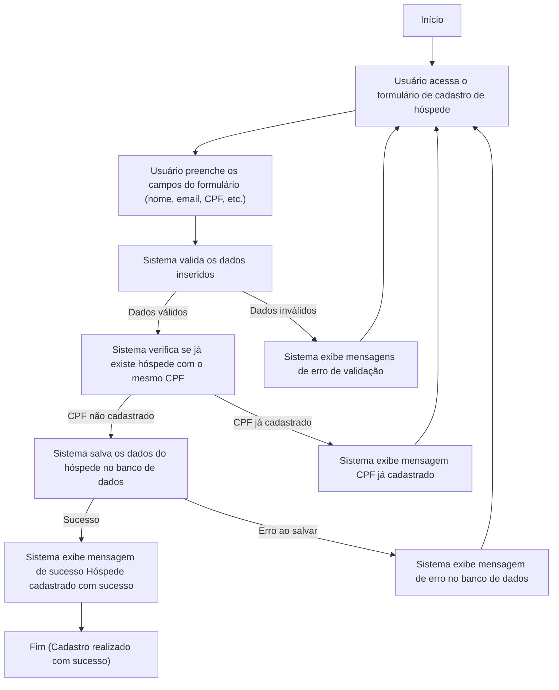

```mermaid
graph TD
    A[Início] --> B[Usuário acessa o formulário de cadastro de hóspede];
    B --> C["Usuário preenche os campos do formulário (nome, email, CPF, etc.)"];
    C --> D[Sistema valida os dados inseridos];
    D -- Dados válidos --> E[Sistema verifica se já existe hóspede com o mesmo CPF];
    E -- CPF não cadastrado --> F[Sistema salva os dados do hóspede no banco de dados];
    E -- CPF já cadastrado --> G["Sistema exibe mensagem "CPF já cadastrado""];
    G --> B;
    F -- Sucesso --> H["Sistema exibe mensagem de sucesso "Hóspede cadastrado com sucesso""];
    H --> I["Fim (Cadastro realizado com sucesso)"];
    D -- Dados inválidos --> J[Sistema exibe mensagens de erro de validação];
    J --> B;
    F -- Erro ao salvar --> K[Sistema exibe mensagem de erro no banco de dados];
    K --> B;
```