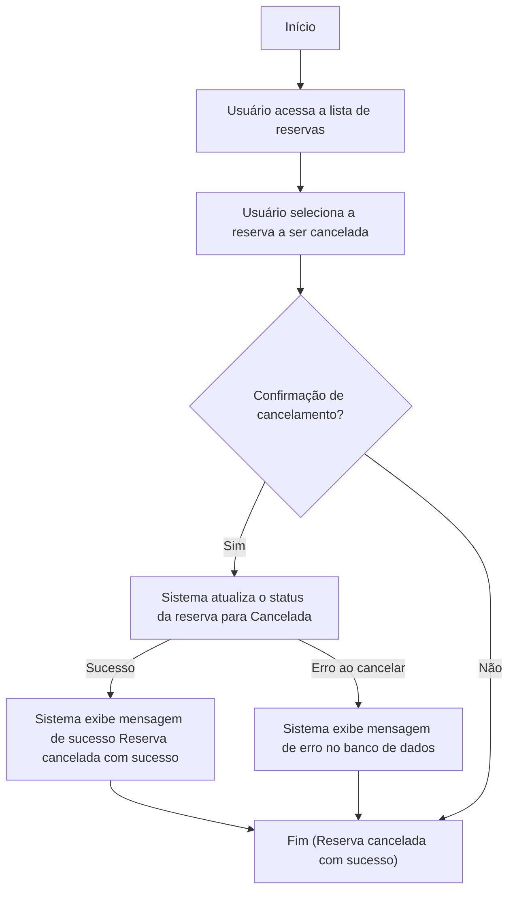

```mermaid
graph TD
    A[Início] --> B[Usuário acessa a lista de reservas];
    B --> C[Usuário seleciona a reserva a ser cancelada];
    C --> D{Confirmação de cancelamento?};
    D -- Sim --> E["Sistema atualiza o status da reserva para "Cancelada""];
    E -- Sucesso --> F["Sistema exibe mensagem de sucesso "Reserva cancelada com sucesso""];
    F --> G["Fim (Reserva cancelada com sucesso)"];
    E -- Erro ao cancelar --> H[Sistema exibe mensagem de erro no banco de dados];
    H --> G;
    D -- Não --> G;
```