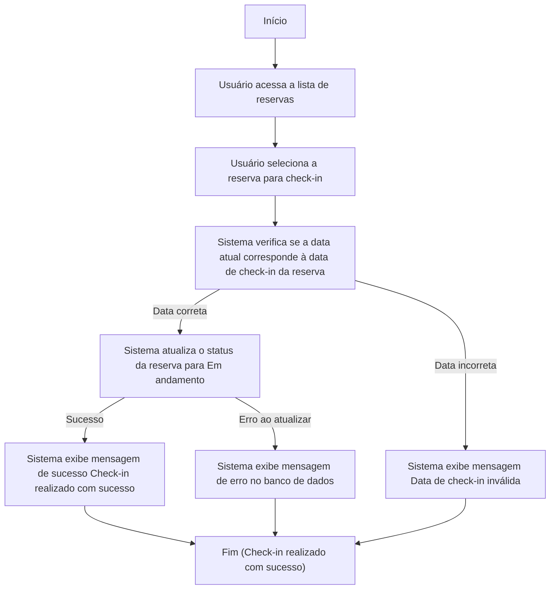

```mermaid
graph TD
    A[Início] --> B[Usuário acessa a lista de reservas];
    B --> C[Usuário seleciona a reserva para check-in];
    C --> D[Sistema verifica se a data atual corresponde à data de check-in da reserva];
    D -- Data correta --> E["Sistema atualiza o status da reserva para "Em andamento""];
    E -- Sucesso --> F["Sistema exibe mensagem de sucesso "Check-in realizado com sucesso""];
    F --> G["Fim (Check-in realizado com sucesso)"];
    D -- Data incorreta --> H["Sistema exibe mensagem "Data de check-in inválida""];
    H --> G;
    E -- Erro ao atualizar --> I[Sistema exibe mensagem de erro no banco de dados];
    I --> G;
```