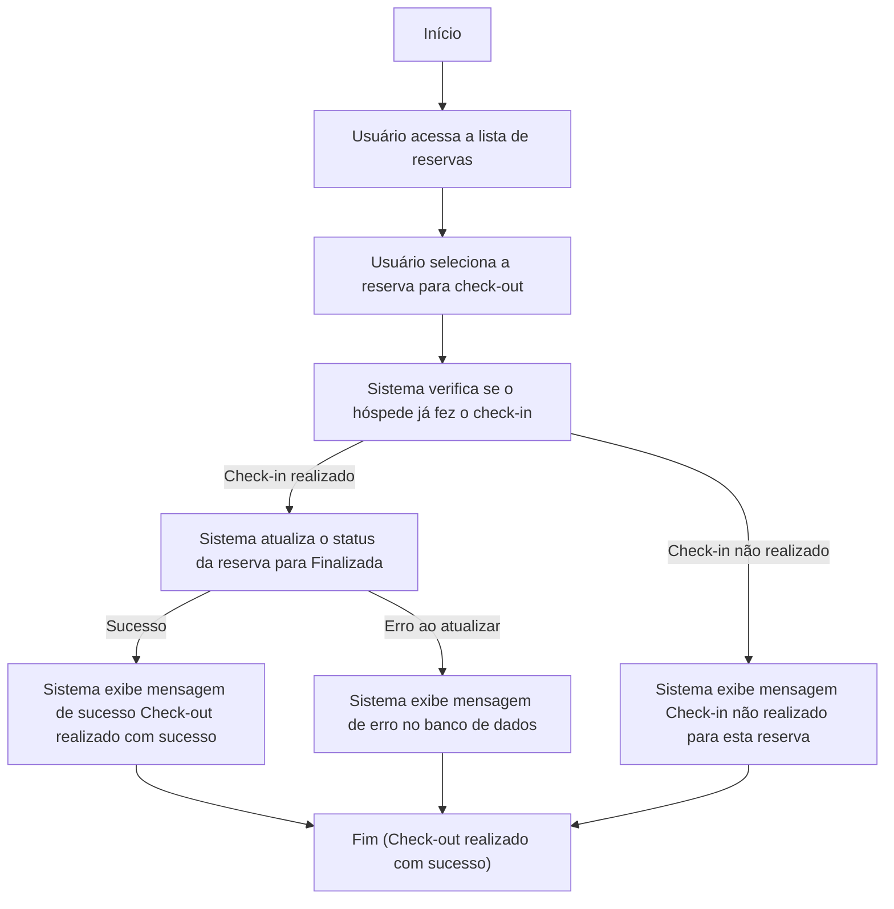

```mermaid
graph TD
    A[Início] --> B[Usuário acessa a lista de reservas];
    B --> C[Usuário seleciona a reserva para check-out];
    C --> D[Sistema verifica se o hóspede já fez o check-in];
    D -- Check-in realizado --> E["Sistema atualiza o status da reserva para "Finalizada""];
    E -- Sucesso --> F["Sistema exibe mensagem de sucesso "Check-out realizado com sucesso""];
    F --> G["Fim (Check-out realizado com sucesso)"];
    D -- Check-in não realizado --> H["Sistema exibe mensagem "Check-in não realizado para esta reserva""];
    H --> G;
    E -- Erro ao atualizar --> I[Sistema exibe mensagem de erro no banco de dados];
    I --> G;
```