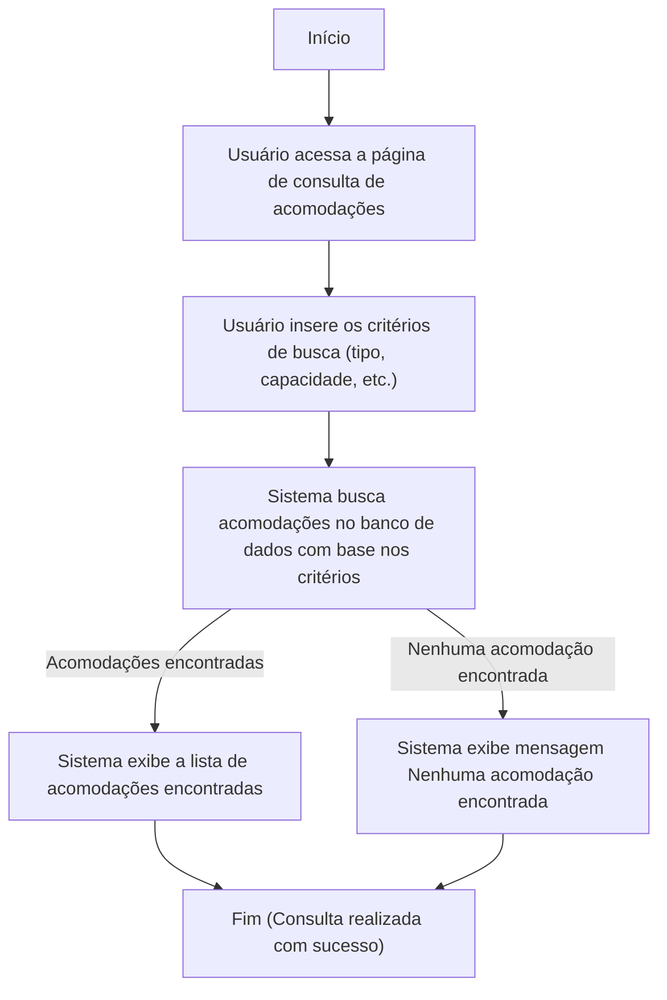

```mermaid
graph TD
    A[Início] --> B[Usuário acessa a página de consulta de acomodações];
    B --> C["Usuário insere os critérios de busca (tipo, capacidade, etc.)"];
    C --> D[Sistema busca acomodações no banco de dados com base nos critérios];
    D -- Acomodações encontradas --> E[Sistema exibe a lista de acomodações encontradas];
    E --> F["Fim (Consulta realizada com sucesso)"];
    D -- Nenhuma acomodação encontrada --> G["Sistema exibe mensagem "Nenhuma acomodação encontrada""];
    G --> F;
```