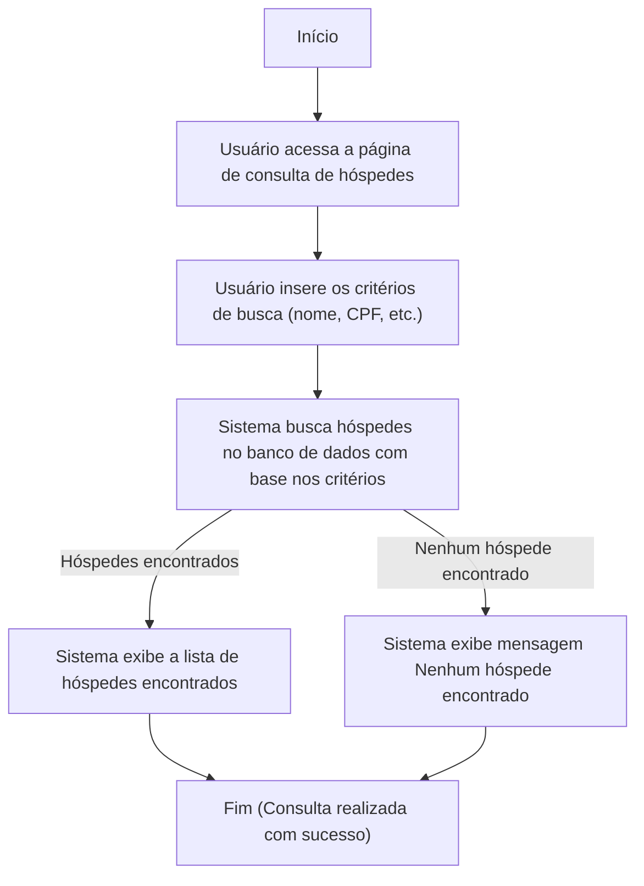

```mermaid
graph TD
    A[Início] --> B[Usuário acessa a página de consulta de hóspedes];
    B --> C["Usuário insere os critérios de busca (nome, CPF, etc.)"];
    C --> D[Sistema busca hóspedes no banco de dados com base nos critérios];
    D -- Hóspedes encontrados --> E[Sistema exibe a lista de hóspedes encontrados];
    E --> F["Fim (Consulta realizada com sucesso)"];
    D -- Nenhum hóspede encontrado --> G["Sistema exibe mensagem "Nenhum hóspede encontrado""];
    G --> F;
```