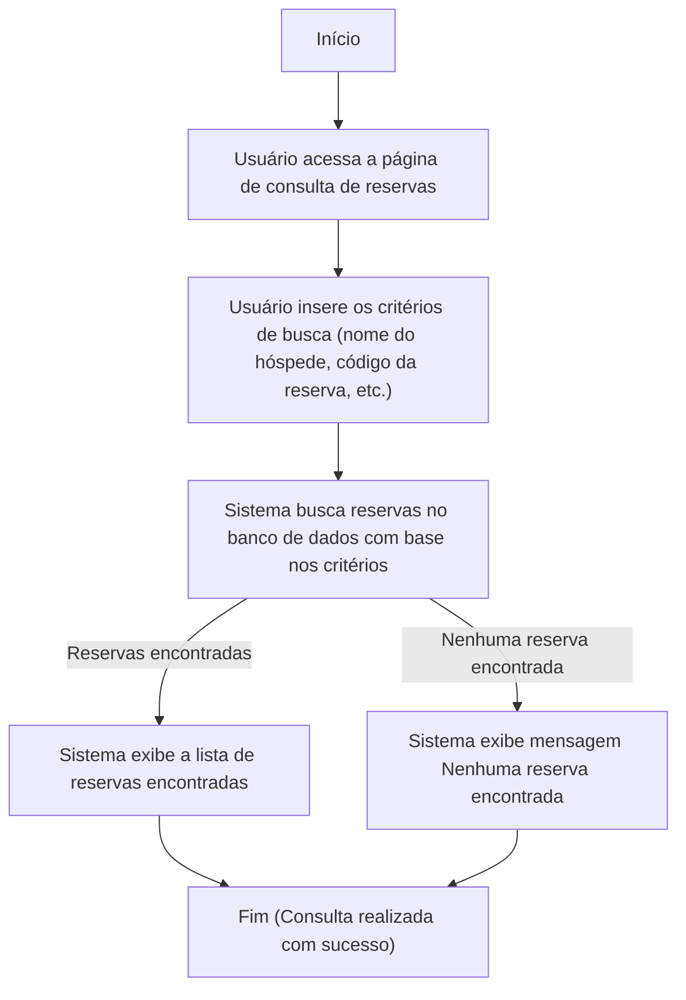

```mermaid
graph TD
    A[Início] --> B[Usuário acessa a página de consulta de reservas];
    B --> C["Usuário insere os critérios de busca (nome do hóspede, código da reserva, etc.)"];
    C --> D[Sistema busca reservas no banco de dados com base nos critérios];
    D -- Reservas encontradas --> E[Sistema exibe a lista de reservas encontradas];
    E --> F["Fim (Consulta realizada com sucesso)"];
    D -- Nenhuma reserva encontrada --> G["Sistema exibe mensagem "Nenhuma reserva encontrada""];
    G --> F;
```