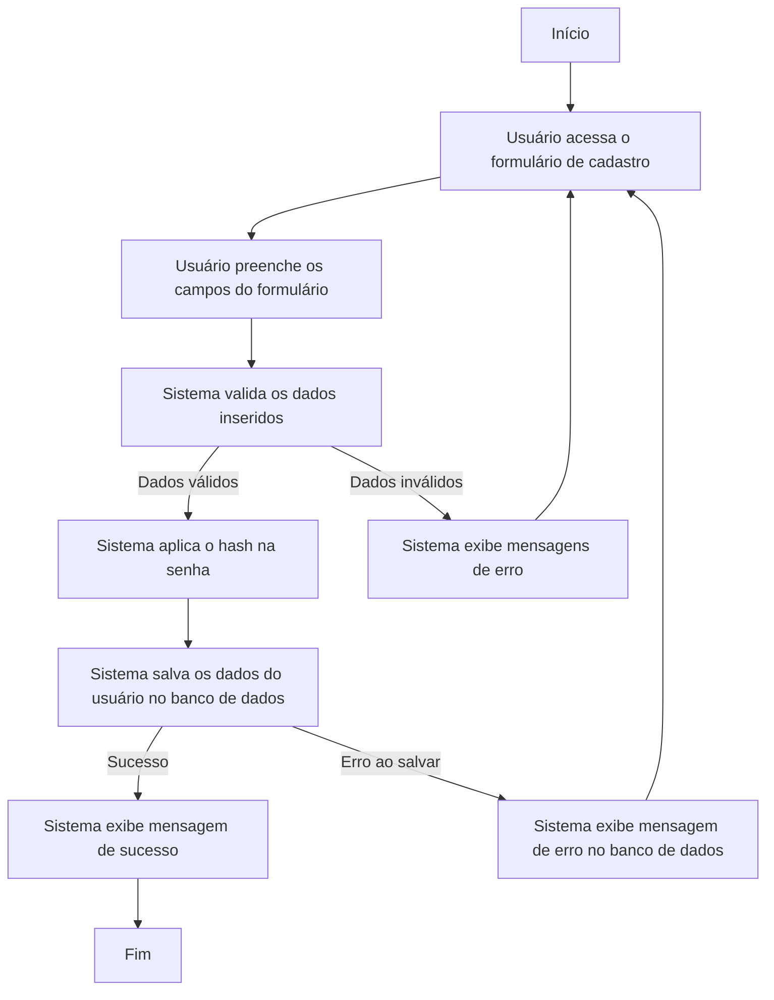

```mermaid
graph TD
    A[Início] --> B[Usuário acessa o formulário de cadastro];
    B --> C[Usuário preenche os campos do formulário];
    C --> D[Sistema valida os dados inseridos];
    D -- Dados válidos --> E[Sistema aplica o hash na senha];
    E --> F[Sistema salva os dados do usuário no banco de dados];
    F -- Sucesso --> G[Sistema exibe mensagem de sucesso];
    G --> H[Fim];
    D -- Dados inválidos --> I[Sistema exibe mensagens de erro];
    I --> B;
    F -- Erro ao salvar --> J[Sistema exibe mensagem de erro no banco de dados];
    J --> B;
```