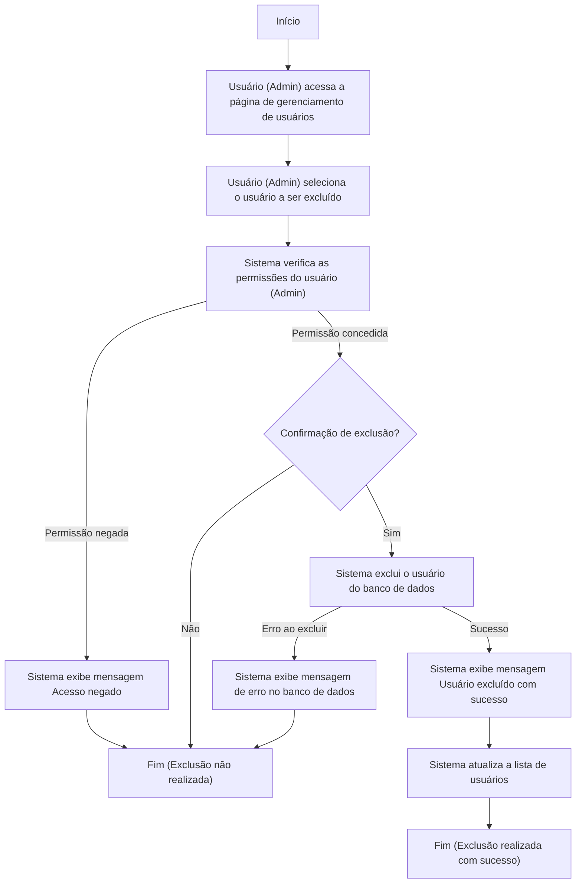

```mermaid
graph TD
    A[Início] --> B["Usuário (Admin) acessa a página de gerenciamento de usuários"];
    B --> C["Usuário (Admin) seleciona o usuário a ser excluído"];
    C --> D["Sistema verifica as permissões do usuário (Admin)"];
    D -- Permissão concedida --> E{Confirmação de exclusão?};
    D -- Permissão negada --> F["Sistema exibe mensagem "Acesso negado""];
    F --> G["Fim (Exclusão não realizada)"];
    E -- Sim --> H[Sistema exclui o usuário do banco de dados];
    E -- Não --> G;
    H -- Sucesso --> I["Sistema exibe mensagem "Usuário excluído com sucesso""];
    I --> J[Sistema atualiza a lista de usuários];
    J --> K["Fim (Exclusão realizada com sucesso)"];
    H -- Erro ao excluir --> L[Sistema exibe mensagem de erro no banco de dados];
    L --> G;
```