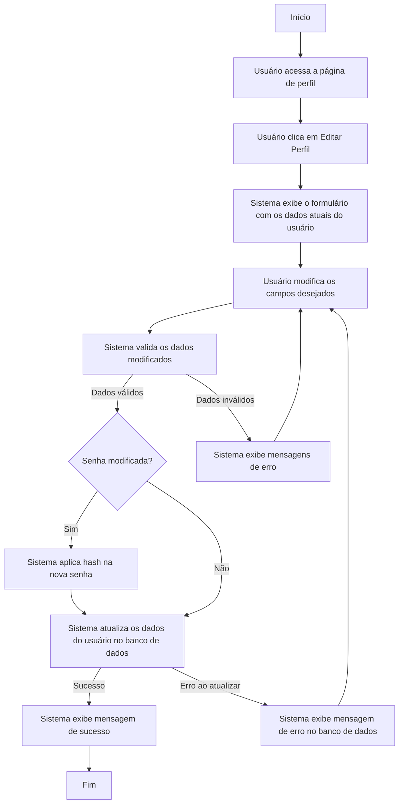

```mermaid
graph TD
    A[Início] --> B[Usuário acessa a página de perfil];
    B --> C[Usuário clica em Editar Perfil];
    C --> D[Sistema exibe o formulário com os dados atuais do usuário];
    D --> E[Usuário modifica os campos desejados];
    E --> F[Sistema valida os dados modificados];
    F -- Dados válidos --> G{Senha modificada?};
    G -- Sim --> H[Sistema aplica hash na nova senha];
    H --> I[Sistema atualiza os dados do usuário no banco de dados];
    G -- Não --> I;
    I -- Sucesso --> J[Sistema exibe mensagem de sucesso];
    J --> K[Fim];
    F -- Dados inválidos --> L[Sistema exibe mensagens de erro];
    L --> E;
    I -- Erro ao atualizar --> M[Sistema exibe mensagem de erro no banco de dados];
    M --> E;
```