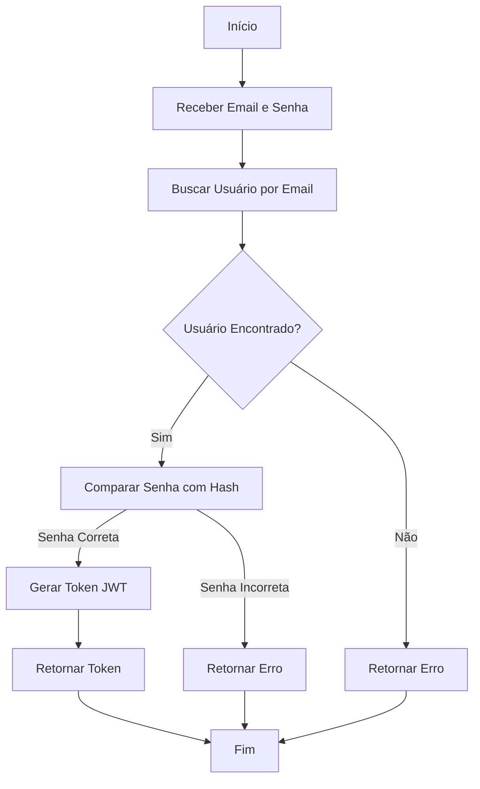

```mermaid
graph TD
    A[Início] --> B[Receber Email e Senha];
    B --> C[Buscar Usuário por Email];
    C --> D{Usuário Encontrado?};
    D -- Sim --> E[Comparar Senha com Hash];
    D -- Não --> F[Retornar Erro];
    E -- Senha Correta --> G[Gerar Token JWT];
    E -- Senha Incorreta --> H[Retornar Erro];
    G --> I[Retornar Token];
    I --> J[Fim];
    F --> J;
    H --> J;
```