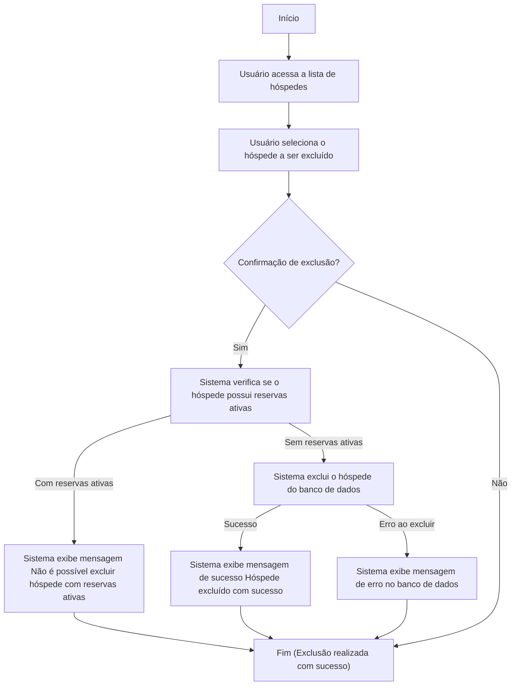

```mermaid
graph TD
    A[Início] --> B[Usuário acessa a lista de hóspedes];
    B --> C[Usuário seleciona o hóspede a ser excluído];
    C --> D{Confirmação de exclusão?};
    D -- Sim --> E[Sistema verifica se o hóspede possui reservas ativas];
    E -- Sem reservas ativas --> F[Sistema exclui o hóspede do banco de dados];
    E -- Com reservas ativas --> G["Sistema exibe mensagem "Não é possível excluir hóspede com reservas ativas""];
    G --> I["Fim (Exclusão não realizada)"];
    F -- Sucesso --> H["Sistema exibe mensagem de sucesso "Hóspede excluído com sucesso""];
    H --> I["Fim (Exclusão realizada com sucesso)"];
    F -- Erro ao excluir --> J[Sistema exibe mensagem de erro no banco de dados];
    J --> I;
    D -- Não --> I;
```