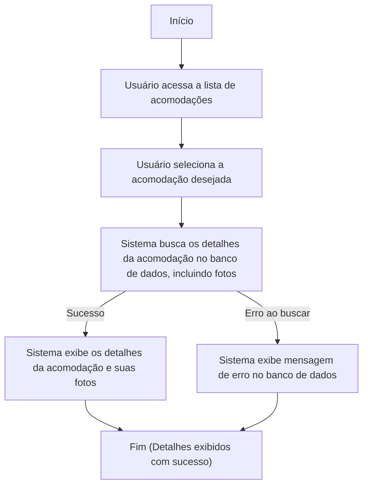

```mermaid
graph TD
    A[Início] --> B[Usuário acessa a lista de acomodações];
    B --> C[Usuário seleciona a acomodação desejada];
    C --> D[Sistema busca os detalhes da acomodação no banco de dados, incluindo fotos];
    D -- Sucesso --> E[Sistema exibe os detalhes da acomodação e suas fotos];
    E --> F["Fim (Detalhes exibidos com sucesso)"];
    D -- Erro ao buscar --> G[Sistema exibe mensagem de erro no banco de dados];
    G --> F;
```